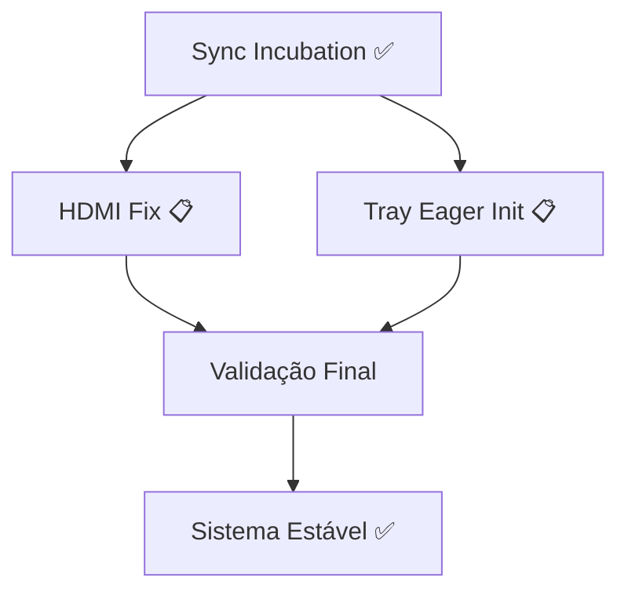

# Sequência de Implementação - Quickshell Patched

**Última atualização**: 2026-02-03  
**Status**: 🔄 Atualizado - Documentação Consolidada

---

## 📚 Documentação Consolidada

Este documento define a ordem de implementação. **Documentos obsoletos foram substituídos por versões consolidadas e implementáveis.**

### Documentos Principais

| Documento | Descrição | Status |
|-----------|-----------|--------|
| **[01-quickshell-stability-final.md](01-quickshell-stability-final.md)** | Plano consolidado completo - diagnóstico, decisões, implementações | ✅ FONTE ÚNICA |
| **[02-hdmi-fix-implementation.md](02-hdmi-fix-implementation.md)** | Implementação HDMI fix - código pronto, testes definidos | 📋 PRONTO |
| **[03-tray-eager-init-implementation.md](03-tray-eager-init-implementation.md)** | Implementação Tray fix - código pronto, testes definidos | 📋 PRONTO |
| **Este documento** | Sequência e priorização | ✅ ATUALIZADO |

### Documentos Obsoletos (Não Usar)

❌ `01-quickshell-stability-plan.md` → Substituído por `01-quickshell-stability-final.md`  
❌ `03-quickshell-patches.md` → Consolidado em `01-quickshell-stability-final.md`  
❌ `04-hdmi-disconnect-crash-fix.md` → Substituído por `02-hdmi-fix-implementation.md`  
❌ `22-tray-*.md` (3 arquivos) → Substituído por `03-tray-eager-init-implementation.md`

---

## 🎯 Status Atual (Commit 216d4be)

| Componente | Status | Implementação | Próximo Passo |
|-----------|--------|---------------|---------------|
| **Sync Incubation** | ✅ ATIVO | Patch 216d4be | — |
| **HDMI Fix** | ❌ CRASHA | Pendente | Implementar 02 |
| **System Tray** | ❌ QUEBRADO | Pendente | Implementar 03 |
| **File Watching** | ⚠️ WORKAROUND | Scripts matam shell | Baixa prioridade |
| **Fechar Janelas** | ⚠️ WORKAROUND | Delay 50ms script | Sem ação planejada |

---

## 📋 Ordem de Implementação

### Fase 1: Crítico - Multi-monitor

**Item**: HDMI Disconnect Fix  
**Doc**: [02-hdmi-fix-implementation.md](02-hdmi-fix-implementation.md)  
**Prioridade**: 🔴 ALTA  
**Complexidade**: 🟡 Média  
**Tempo**: 2-3h (implementação + testes)  
**Motivo**: Impede uso confiável multi-monitor

**Ação**:
```bash
# Ver 02-hdmi-fix-implementation.md seção "Implementação"
# Modificar src/window/proxywindow.cpp - onScreenDestroyed()
```

**Validação**: 6 cenários de teste definidos (ver doc)

---

### Fase 2: Funcionalidade - System Tray

**Item**: Tray Eager Init  
**Doc**: [03-tray-eager-init-implementation.md](03-tray-eager-init-implementation.md)  
**Prioridade**: 🟠 MÉDIA  
**Complexidade**: 🟢 Baixa  
**Tempo**: 30min (implementação + testes)  
**Motivo**: Tray é feature importante, implementação simples

**Ação**:
```bash
# Ver 03-tray-eager-init-implementation.md seção "Implementação"
# Criar src/services/status_notifier/init.cpp
# Modificar src/services/status_notifier/CMakeLists.txt
```

**Validação**: 6 cenários de teste definidos (ver doc)

---

### Fase 3: Opcional - File Watching

**Item**: Desabilitar file watching em desktop entries  
**Doc**: `01-quickshell-stability-final.md` seção "4. Qt6 QML File Watching"  
**Prioridade**: 🟡 BAIXA  
**Complexidade**: 🟡 Média  
**Tempo**: 2-4h  
**Motivo**: Workaround atual é aceitável

**Ação**: Baixa prioridade; implementar apenas se tempo permitir.

---

## 🔗 Dependências



| Item | Depende de | Observação |
|------|------------|------------|
| HDMI Fix | Sync Incubation (já ativo) | Independente; pode implementar agora |
| Tray Eager Init | Sync Incubation (já ativo) | Depende do patch estar ativo |
| File Watching | — | Independente; baixa prioridade |

---

## 📊 Patches Ativos

Ver tabela completa em `01-quickshell-stability-final.md` seção "Implementações".

| Arquivo | Alteração | Commit | Status |
|---------|-----------|--------|--------|
| `src/core/lazyloader.cpp` | `Synchronous` incubation | 216d4be | ✅ Ativo |
| `src/core/boundcomponent.cpp` | `Synchronous` incubation | 216d4be | ✅ Ativo |
| `src/window/proxywindow.cpp` | HDMI screen migration | Pendente | 📋 A implementar |
| `src/services/status_notifier/init.cpp` | Tray eager init | Pendente | 📋 A implementar |

---

## ✅ Checklist de Conclusão

### HDMI Fix
- [ ] Implementar código em `proxywindow.cpp`
- [ ] Build e instalar
- [ ] Passar 6 cenários de teste
- [ ] Verificar sem regressões
- [ ] Commitar no quickshell-patched
- [ ] Atualizar `01-quickshell-stability-final.md` com ✅

### Tray Eager Init
- [ ] Criar `init.cpp`
- [ ] Modificar `CMakeLists.txt`
- [ ] Build e instalar
- [ ] Passar 6 cenários de teste
- [ ] Verificar crashes não voltaram
- [ ] Commitar no quickshell-patched
- [ ] Atualizar `01-quickshell-stability-final.md` com ✅
- [ ] Deletar docs obsoletos `22-tray-*.md`

### Validação Final
- [ ] Todos os testes passam
- [ ] Zero crashes em uso normal
- [ ] Performance aceitável (< 100ms UI updates)
- [ ] Documentação atualizada
- [ ] Quickshell estável e rápido ✅

---

## 🚀 Quick Start

Para implementar agora:

1. **Ler**: `01-quickshell-stability-final.md` (entender contexto completo)
2. **Implementar**: `02-hdmi-fix-implementation.md` (alta prioridade)
3. **Testar**: Seguir checklist de validação
4. **Implementar**: `03-tray-eager-init-implementation.md` (após HDMI)
5. **Validar**: Todos os testes de regressão

---

**Autor**: Claude (AI Assistant)  
**Data**: 2026-02-03  
**Confiabilidade**: ⭐⭐⭐⭐⭐ (Documentação consolidada, planos implementáveis, sem contradições)
