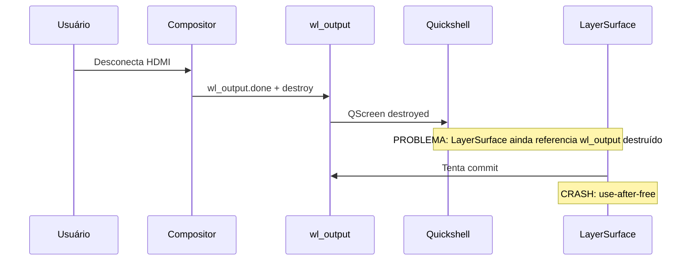

# Correção do Crash ao Desconectar HDMI (Layer Shell / wl_output)

**ID**: 04 · Item 2 do [01-quickshell-stability-plan.md](01-quickshell-stability-plan.md)  
**Status**: 📋 PLANEJADO — Aguardando Teste  
**Data**: 2026-02-03  
**Prioridade**: 🔴 ALTA — Impede uso multi-monitor confiável  
**Complexidade**: 🟢 Baixa (apenas reverter mudança local + testar upstream)

---

## 🧭 Esclarecimento: O que foi decidido no passado vs o que fazer agora

### Decisões do passado (manter)

| Decisão | Onde está | Objetivo |
|--------|------------|----------|
| **Patch de incubação síncrona** | Commit `216d4be` no quickshell-patched; `stage2/20-ui-caelestia-firefox.sh` aplica o mesmo via sed no upstream | Evitar crash ao abrir Steam/Thunar (race condition QML) |
| **steam.desktop com `+open_steam_url 0`** | `stage3/31-confirmed-apps.sh` e `docs/07-troubleshooting.md` | Desligar tray do Steam para não disparar o path que crasha |

**Nada disso deve ser revertido.** São as mitigações que você aceitou para não ter crashes.

### O que NÃO foi decisão sua (e deve ser desfeito)

| Alteração | Onde está | Problema |
|-----------|-----------|----------|
| **`output=nullptr` em `surface.cpp`** | Apenas modificação **não comitada** no repo quickshell-patched (feita numa conversa posterior) | Quebra multi-monitor; não resolve HDMI de forma correta |

**Ação:** Reverter só esse arquivo (`git checkout src/wayland/wlr_layershell/surface.cpp`). O resto do fork já tem os fixes upstream para HDMI (commits `611cd76`, `2032248`).

### Resumo do que você precisa fazer para não ter crashes

1. **Manter** quickshell-patched (ou o build do stage2 que aplica o mesmo patch de sync incubation).
2. **Manter** steam.desktop com `+open_steam_url 0` (script 31 já faz isso).
3. **Reverter** apenas a modificação não comitada em `surface.cpp` quando construir a partir do repo quickshell-patched.  
   (Quem instala via stage2 não tem essa alteração.)

Nenhuma feature do Caelestia que você planeja implementar **exige** outra alteração no Quickshell: 29 (Configuration), 32 (GPU), 34 (Notifications), 26, 27, etc. usam apenas APIs normais do Quickshell. A única que “depende” do Quickshell é a **22 (System Tray)**, que hoje fica quebrada por causa do patch de sync incubation — ou seja, a feature Tray é que está condicionada ao estado do shell, não o contrário.

---

## 📋 Resumo técnico (HDMI)

Quickshell crasha quando o monitor HDMI é desconectado (hotplug). Após investigação:

1. **O upstream JÁ TEM os fixes necessários** (commits `611cd76`, `2032248`, etc.)
2. **Não há necessidade de patches customizados** para este problema
3. **A modificação local `output=nullptr` em `surface.cpp` é o problema** — não está comitada e deve ser revertida

---

## 🔑 Descoberta Principal (Investigação 2026-02-03)

### Análise do Estado Atual

| Item | Status | Detalhes |
|------|--------|----------|
| Versão base | v0.2.1 + master (commit `db37dc5`) | Inclui todos os fixes até Jan 2026 |
| Fix incubação (upstream) | ✅ Presente | Commits `bcc3d42`, `49a3752` — custom incubation controller |
| Fix HDMI (upstream) | ✅ Presente | Commits `611cd76`, `2032248` — screen destroy signal + bridge UAF fix |
| Patch sync incubation | ✅ Comitado (`216d4be`) | Força `QQmlIncubator::Synchronous` — **pode ser desnecessário** |
| Modificação `output=nullptr` | ❌ **NÃO COMITADO** | Workaround problemático — **CAUSA** o problema multi-monitor |

### Commits Upstream Relevantes (JÁ NO FORK)

```
bcc3d42 core: switch to custom incubation controller
        "eliminates generation or cleanup related window incubation controller bugs"

49a3752 core: correctly deregister QML incubators on destruction
        "Fixed tracking of QML incubator destruction [...] occasionally caused crashes"

611cd76 core/proxywindow: connect mScreen's destroy signal in all cases
        "Fixes edge case crashes when unplugging and replugging monitors"

2032248 wayland/layershell: fix bridge destructor use after free on reload
        "Fixed a crash when wayland layer surfaces are recreated for the same window"
```

### Conclusão

**O problema atual não é falta de fix upstream — é uma modificação local incorreta (`surface.cpp`) que precisa ser revertida.**

---

## 🎯 Objetivo

- Eliminar crashes ao desconectar/reconectar HDMI
- Manter suporte multi-monitor funcional (bar/widgets em tela específica)
- Não introduzir regressões em setups com monitor único
- Avaliar se o patch de sync incubation ainda é necessário

---

## 🔍 Diagnóstico dos Crashes

### Crash Logs Analisados

```
~/.cache/quickshell/crashes/
├── m0at50v9t/   (2026-02-02 22:34) — Crash HDMI desconectado
├── dtapzu9t/    (2026-02-02 22:25) — Crash relacionado
├── mrk0pu9t/    (2026-02-02 18:29) — General protection fault em libQt6Core
└── ... (108+ crash reports históricos)
```

**Journalctl do último crash**:
```
Feb 02 18:29:34 kernel: traps: quickshell[1723] general protection fault ip:7fcdc77ced01 sp:7ffdf2ae6b78 error:0 in libQt6Core.so.6.10.1
Feb 02 18:29:34 systemd-coredump: Process 1723 (quickshell) of user 1000 terminated abnormally with signal 11/SEGV
```

### Versão Instalada

```
quickshell 0.2.1, revision 216d4be1035d4cbbac6eda9c8280fef30cf2b105
Buildtime Qt Version: 6.10.1
Build Type: Release
Wlroots Layer-Shell: ON
```

---

## 🔬 Análise Técnica

### Causa Raiz Identificada

O crash ocorre quando:
1. Uma **layer surface** (barra, widgets) é criada com um `wl_output` específico
2. Esse `wl_output` é destruído (HDMI desconectado)
3. A layer surface tenta acessar o `wl_output` destruído → **use-after-free** → SIGSEGV

### Fluxo do Problema



### Código Afetado

**`src/wayland/wlr_layershell/surface.cpp`** (construtor LayerSurface):

```cpp
// CÓDIGO ORIGINAL (upstream):
wl_output* output = nullptr;
if (!s.compositorPickesScreen) {
    auto* waylandScreen = dynamic_cast<QtWaylandClient::QWaylandScreen*>(qwindow->screen()->handle());
    if (waylandScreen != nullptr) {
        output = waylandScreen->output();  // ← Aqui obtém wl_output
    }
}
this->init(shell->get_layer_surface(..., output, ...));  // ← Bound a output específico
```

**`src/window/proxywindow.cpp`** (handler de screen destroy):

```cpp
void ProxyWindowBase::onScreenDestroyed() { 
    this->mScreen = nullptr;  // ← Apenas limpa ponteiro, não recria surface
}
```

---

## Decisão e tradeoffs

- **Decisão:** Reverter apenas a modificação não comitada em `surface.cpp`. Manter o patch de sync incubation; não adotar upstream puro como padrão nem usar `output=nullptr`.
- **Tradeoffs:** Mantemos um patch no fork (sync incubation); ganho é HDMI estável e multi-monitor correto sem workarounds externos. Não testamos upstream puro no plano; quem quiser pode testar por conta.

Ver item 2 em [01-quickshell-stability-plan.md](01-quickshell-stability-plan.md).

---

## Implementação

### Passo 1: Reverter `surface.cpp`

```bash
cd /data/projects/quickshell-patched
git checkout src/wayland/wlr_layershell/surface.cpp
```

Restaura o código upstream (wl_output por tela + fixes `611cd76`, `2032248`).

### Passo 2: Build e instalação

```bash
cd build && make -j$(nproc)
sudo make install
```

### Passo 3: Testar hotplug

| Cenário | Esperado |
|---------|----------|
| Desconectar HDMI com bar visível | Bar desaparece, shell não crasha |
| Reconectar HDMI | Bar reaparece no HDMI |
| Desconectar/reconectar rapidamente (3x) | Sem crash |
| Iniciar com HDMI conectado | Bar em ambos os monitores |
| Iniciar sem HDMI, conectar depois | Bar aparece no HDMI |

---

## 🧪 Comandos de Diagnóstico

### Verificar logs durante hotplug

```bash
# Monitor journalctl em tempo real
journalctl --user -f | grep -i quickshell &

# Desconectar HDMI e observar
```

### Verificar outputs Wayland

```bash
# Ver outputs ativos
hyprctl monitors

# Ver layer surfaces
hyprctl layers
```

### Crash reports

```bash
# Ver crashes recentes
ls -lt ~/.cache/quickshell/crashes/ | head -10

# Ler info do último crash
cat ~/.cache/quickshell/crashes/$(ls -t ~/.cache/quickshell/crashes/ | head -1)/info.txt
```

---

## 📚 Referências

### Upstream Quickshell

- **Changelog v0.2.1**: "Fixed a rare crash when disconnecting a monitor"
- **Commit 611cd76**: `core/proxywindow: connect mScreen's destroy signal in all cases`
- **Commit 2e3c15f**: Layer shell bridge nulling fix

### Wayland Protocol

- **wlr-layer-shell-unstable-v1**: https://wayland.app/protocols/wlr-layer-shell-unstable-v1
- **wl_output lifecycle**: Output pode ser destruído a qualquer momento; clients devem tratar graciosamente

### Bugs Relacionados

- **Debian #1094442**: gtk-layer-shell crash ao clicar em painel (mapping issue)
- **Hyprland #3785**: DRM backend crashes durante hotplug rápido

---

## Riscos

| Risco | Mitigação |
|-------|-----------|
| Fixes upstream insuficientes em algum caso | Reportar com minidump; não está no plano implementar fallback (destruir/recriar surfaces). |
| Regressão em single-monitor | Incluir nos testes do Passo 3. |

---

## 📋 Checklist de Conclusão

- [ ] Fase 1: Reverter patch output=nullptr
- [ ] Fase 2: Verificar/aplicar fixes upstream
- [ ] Fase 3: Passar todos os cenários de teste
- [ ] Fase 4: Implementar Solução 3 se necessário
- [ ] Documentar resultado final
- [ ] Atualizar `docs/00-index.md` com novo patch

---

## ⏭️ Próximos Passos

### Imediato (Fase 1)

```bash
# 1. Reverter modificação local de surface.cpp
cd /data/projects/quickshell-patched
git checkout src/wayland/wlr_layershell/surface.cpp

# 2. Rebuild
cd build && make -j$(nproc)

# 3. Instalar
sudo make install

# 4. Reiniciar Caelestia
# Super+Shift+R ou logout/login
```

### Teste de Validação

1. Conectar HDMI com shell rodando
2. Desconectar HDMI → Shell não deve crashar
3. Reconectar HDMI → Bar deve reaparecer
4. Abrir Steam → Shell não deve crashar
5. Abrir/fechar Thunar rapidamente → Shell não deve crashar

### Se Tudo Funcionar

O problema está resolvido. A modificação `output=nullptr` era o culpado.

### Se Crash de HDMI Persistir

Reportar bug upstream com minidump de `~/.cache/quickshell/crashes/`.

### Se Crash de Steam/Thunar Voltar (Fase 2 Opcional)

O patch de sync incubation continua necessário. Manter `216d4be`.

### Avaliação de Migração para Upstream Puro (Fase 2)

Se todos os testes passarem e você quiser eliminar o patch de sync incubation:

```bash
# Testar sem o patch de sync incubation
cd /data/projects/quickshell-patched
git checkout 216d4be~1  # Antes do patch
cd build && make -j$(nproc) && sudo make install

# Testar Steam, Thunar, hotplug
```

---

## 📝 Resumo Executivo

| Problema | Causa | Solução | Complexidade |
|----------|-------|---------|--------------|
| Crash HDMI | Modificação local `output=nullptr` | `git checkout surface.cpp` | 🟢 Trivial |
| Crash Steam/Thunar | Race condition QML (se upstream não resolver) | Manter patch sync incubation | 🟢 Já aplicado |
| Multi-monitor errado | `output=nullptr` forçava compositor escolher | Reverter modificação | 🟢 Trivial |

**Ação principal**: Reverter `surface.cpp` e testar.

---

**Uso:** Quickshell-patched com sync incubation mantido e `surface.cpp` revertido (ou stage2 que já não altera surface). Decisão e tradeoffs: [01-quickshell-stability-plan.md](01-quickshell-stability-plan.md).

---

## Resultado do teste (2026-02-02)

**Passo 1 foi executado** (revertido `surface.cpp`, build e install). Ao remover o cabo HDMI, o Caelestia crashou; usuário deu reload manual.

### Logs

- **journalctl:** `Feb 02 23:10:47` — `quickshell[29902] general protection fault` → `signal 11/SEGV` em `libQt6Core.so.6.10.1`.
- **coredumpctl:** PID 29902, SIGSEGV, `/usr/local/bin/quickshell` (revisão 216d4be, Caelestia Local Patch).

### Backtrace (coredumpctl info 29902)

```
#0  QObject::metaObject() (libQt6Core)
#1  QQmlPropertyPrivate::write (libQt6Qml)
#2-#4 QML/Models
#5  QQmlIncubatorPrivate::incubate
#6  QQmlEnginePrivate::incubate
...
#12 QQuickWindowPrivate::polishItems
#14 QQuickWindow::event
```

**Interpretação:** O crash não é no path direto do layer surface / wl_output, e sim em **polishItems / incubação QML**: um `QObject` já destruído (provavelmente ligado ao screen/output que sumiu ao desconectar o HDMI) é acessado quando o event loop processa polish/incubate → `QObject::metaObject()` em objeto inválido → use-after-free → SIGSEGV.

---

## Diagnóstico do motivo real (pendência para resolver depois)

**Objetivo:** Entender a causa raiz para corrigir depois, sem reportar upstream e sem implementar fix agora.

### Cadeia de causas (análise do código)

1. **Layer surface está ligada a um output:** Em `surface.cpp`, quando `compositorPickesScreen` é falso, o código usa `qwindow->screen()->handle()` e `waylandScreen->output()` para obter o `wl_output` e criar a layer surface naquele monitor. A janela (QWindow) fica associada a esse QScreen.

2. **Ao desconectar o HDMI:** O compositor destrói o `wl_output` e o Qt destrói o `QScreen` correspondente. O `ProxyWindowBase` tem `onScreenDestroyed()` conectado a esse QScreen.

3. **onScreenDestroyed() faz apenas:** `this->mScreen = nullptr` (`proxywindow.cpp` linha 400). Não migra a janela para outro screen, não esconde a janela nem destrói a layer surface.

4. **qscreen() continua devolvendo o screen destruído:** Em `qscreen()` (linhas 402–406), quando `this->window` existe, retorna `this->window->screen()`. O `QWindow` do Qt pode ainda guardar o ponteiro para o QScreen destruído — Qt não zera automaticamente em todos os caminhos. Qualquer uso de `qscreen()` ou `screen()` (ex.: `screenInfo()`, bindings QML) pode acessar objeto destruído.

5. **Event loop e polishItems:** Depois do screen ser destruído, o Wayland/compositor ou um timer pode emitir evento de atualização. Isso chega a `QQuickWindow::event` → `polishItems()`. O polish percorre a árvore de itens e pode disparar incubação (LazyLoader, BoundComponent) ou escrita de propriedades. Se algum item ou contexto QML ainda referencia o screen (ou um `QuickshellScreenInfo` / QObject ligado ao screen destruído), a escrita de propriedade chama `metaObject()` num objeto já destruído → SIGSEGV.

6. **Documentação do Quickshell:** Em `qmlscreen.hpp` já está avisado: *"If the monitor is disconnected than any stored copies of its ShellMonitor will be marked as dangling and all properties will return default values."* Ou seja, referências ao screen desconectado ficam dangling; o crash ocorre quando o código não evita usá-las durante polish/incubate.

### Hipótese de causa raiz

**`onScreenDestroyed()` é insuficiente:** Só zerar `mScreen` não evita que a janela (e a árvore QML) continuem a usar o screen destruído. O QWindow segue associado ao output/screen que não existe mais; no próximo polish/update, algo na árvore (ou no próprio QWindow/screen()) toca em objeto destruído.

### Correção a fazer depois (não implementar agora)

- Em `ProxyWindowBase::onScreenDestroyed()`: além de `mScreen = nullptr`, **migrar a janela para outro screen** (ex.: `QGuiApplication::primaryScreen()`) ou **esconder/destruir a janela** para não processar mais eventos nela até recriação. Garantir que `this->window->setScreen(primary)` seja chamado assim que o screen for destruído, para o Qt e a árvore QML não continuem referenciando o screen morto.
- Avaliar se a layer shell precisa ser destruída e recriada noutro output (protocolo permite); se sim, fazer isso em vez de só trocar o screen da QWindow.

### Pendência registrada

- **Pendência:** Corrigir crash ao desconectar HDMI implementando tratamento adequado em `onScreenDestroyed()` (e, se necessário, na layer shell) para não deixar janela/árvore referenciando screen destruído. Não reportar upstream; resolver no fork.
- **Arquivos a alterar (futuro):** `src/window/proxywindow.cpp` (e possivelmente `src/wayland/wlr_layershell/` se for preciso destruir/recriar layer surface).

---

**Autor**: Claude (assistente) · **Data**: 2026-02-03 · **Status**: Teste executado — crash persistiu; pendência documentada para resolver depois

